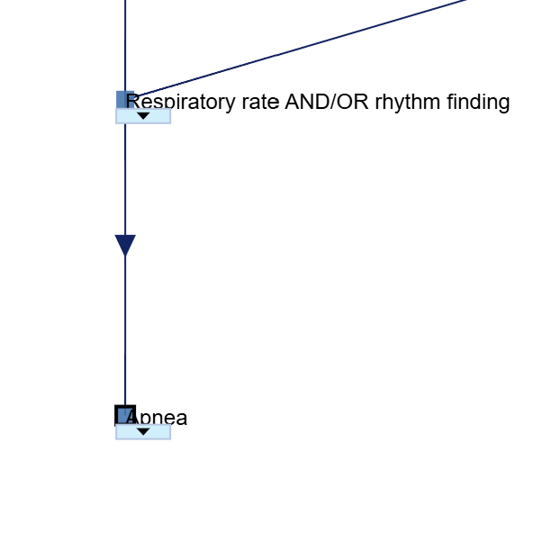
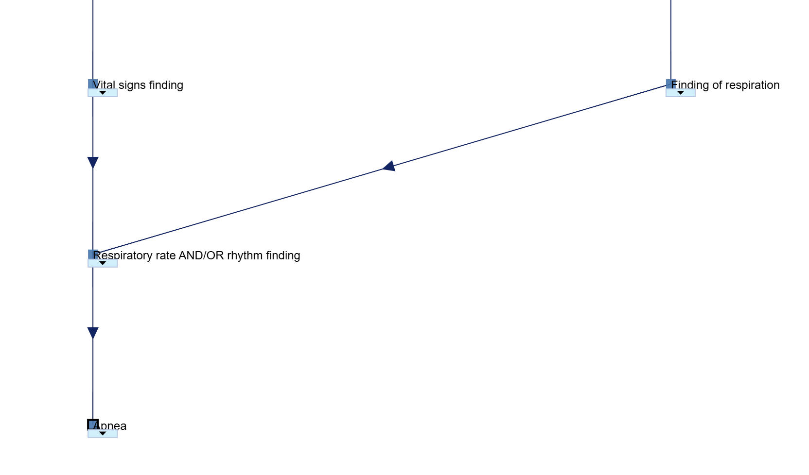
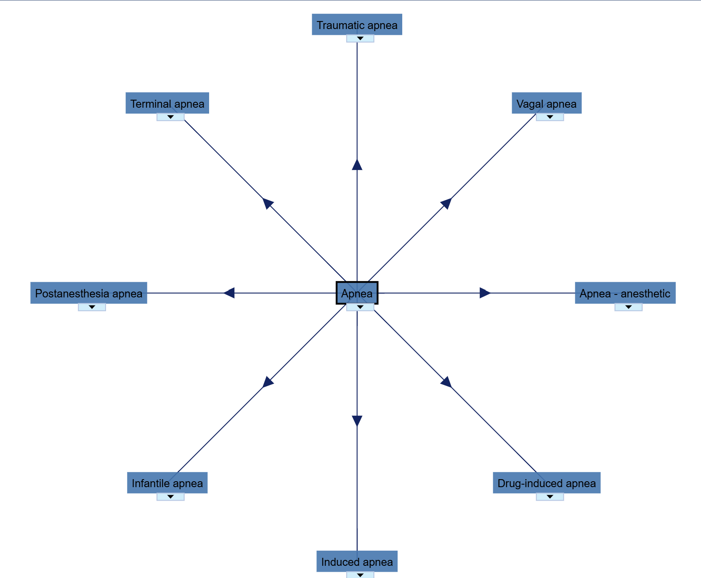
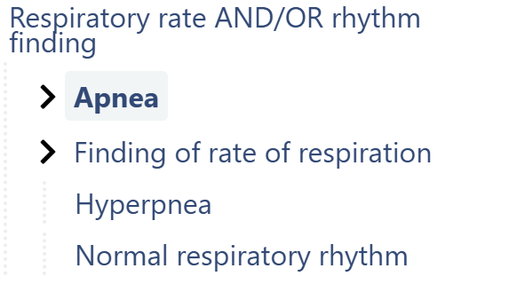

# Manual verification: Apnea

We manually checked the **parent**, **grandparent**, **children**, and **sibling** relationships for this concept.

## Parents



## Grandparents



## Children



## Siblings



We copied the BioPortal children from the file structure into a set and verified its intersection with the API result to see if there are any concepts being retrieved that should not be there, or any missing from the API call. The code below computes that intersection; the result is illustrated in the image below the code.

```python
# -----------------------------
# Define Set 1
# -----------------------------
set1 = {
    "Apnea - anesthetic",
    "Apnea in newborn",
    "Chemoreceptor apnea",
    "Deglutition apnea",
    "Drug-induced apnea",
    "Gastroesophageal reflux disease with apnea",
    "Induced apnea",
    "Infantile apnea",
    "Initial apnea",
    "Late apnea",
    "Postanesthesia apnea",
    "Recurrent apnea",
    "Sleep apnea",
    "Terminal apnea",
    "Traumatic apnea",
    "Vagal apnea"
}

# -----------------------------
# Define Set 2
# -----------------------------
set2 = {
    "Postanesthesia apnea",
    "Drug-induced apnea",
    "Infantile apnea",
    "Terminal apnea",
    "Vagal apnea",
    "Apnea - anesthetic",
    "Traumatic apnea",
    "Induced apnea",
    "Deglutition apnea",
    "Recurrent apnea",
    "Gastroesophageal reflux disease with apnea",
    "Sleep apnea",
    "Initial apnea",
    "Apnea in newborn",
    "Chemoreceptor apnea",
    "Late apnea"
}

# -----------------------------
# Compute intersection
# -----------------------------
intersection = set1.intersection(set2)

set1 = set1 - set2

# -----------------------------
# Output
# -----------------------------
print("Set 1 size (after removal):", len(set1))
print("Set 2 size:", len(set2))
print("Intersection size:", len(intersection))

print("\nIntersection concepts:")
for item in sorted(intersection):
    print("-", item)
```