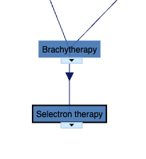
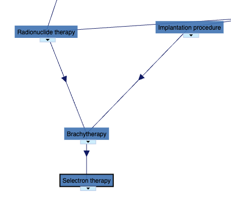
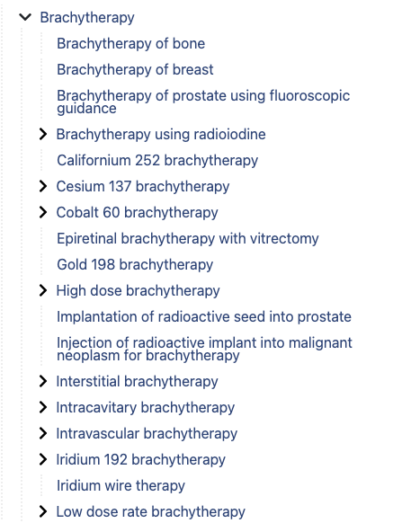

# Manual verification: Selectron therapy

We manually checked the **parent**, **grandparent**, **cousin**, and **sibling** relationships for this concept.

## Parents



## Grandparents



## Cousins

The following code was used to compute the intersection of two sibling sets (cousins). The result is illustrated in the image below.



```python
# -----------------------------
# Define Set 1
# -----------------------------
set1 = {
    "Brachytherapy of bone",
    "Brachytherapy of breast",
    "Brachytherapy of prostate using fluoroscopic guidance",
    "Brachytherapy using radioiodine",
    "Californium 252 brachytherapy",
    "Cesium 137 brachytherapy",
    "Cobalt 60 brachytherapy",
    "Epiretinal brachytherapy with vitrectomy",
    "Gold 198 brachytherapy",
    "High dose brachytherapy",
    "Implantation of radioactive seed into prostate",
    "Injection of radioactive implant into malignant neoplasm for brachytherapy",
    "Interstitial brachytherapy",
    "Intracavitary brachytherapy",
    "Intravascular brachytherapy",
    "Iridium 192 brachytherapy",
    "Iridium wire therapy",
    "Low dose rate brachytherapy",
    "Phosphorus 32 brachytherapy",
    "Pulsed dose rate brachytherapy",
    "Radiation plaque therapy",
    "Radiotherapy: seeds into brain",

    "Radium 223 brachytherapy",
    "Radium 226 brachytherapy",
    "Radon 222 brachytherapy",
    "Rhenium 188 brachytherapy",
    "Ruthenium 106 brachytherapy",

    "Strontium 90 brachytherapy",
    "Surface brachytherapy",
    "Tantalum 182 brachytherapy",
    "Temporary implant radiotherapy",
    "Yttrium 90 brachytherapy"
}

# -----------------------------
# Define Set 2
# -----------------------------
set2 = {
    "Rhenium 188 brachytherapy",
    "Radium 223 brachytherapy",
    "Brachytherapy of prostate using fluoroscopic guidance",
    "Implantation of radioactive seed into prostate",
    "High dose brachytherapy",
    "Surface brachytherapy",
    "Radium 226 brachytherapy",
    "Temporary implant radiotherapy",
    "Interstitial brachytherapy",
    "Intracavitary brachytherapy",
    "Epiretinal brachytherapy with vitrectomy",
    "Gold 198 brachytherapy",
    "Brachytherapy using radioiodine",
    "Pulsed dose rate brachytherapy",
    "Low dose rate brachytherapy",
    "Iridium 192 brachytherapy",
    "Injection of radioactive implant into malignant neoplasm for brachytherapy",
    "Yttrium 90 brachytherapy",
    "Phosphorus 32 brachytherapy",
    "Brachytherapy of breast",
    "Radon 222 brachytherapy",
    "Brachytherapy of bone",
    "Cesium 137 brachytherapy",
    "Intravascular brachytherapy",
    "Tantalum 182 brachytherapy",
    "Californium 252 brachytherapy",
    "Radiotherapy: seeds into brain",
    "Ruthenium 106 brachytherapy",
    "Cobalt 60 brachytherapy",
    "Strontium 90 brachytherapy",
    "Radiation plaque therapy",
    "Iridium wire therapy"
}

# -----------------------------
# Remove unwanted concepts from Set 1
# -----------------------------
to_remove = {
    "Radiotherapy: seeds into hypophysis",
    "Selectron therapy"
}

set1 = set1 - to_remove

# -----------------------------
# Compute intersection
# -----------------------------
intersection = set1.intersection(set2)

# -----------------------------
# Output
# -----------------------------
print("Set 1 size (after removal):", len(set1))
print("Set 2 size:", len(set2))
print("Intersection size:", len(intersection))

print("\nIntersection concepts:")
for item in sorted(intersection):
    print("-", item)
```
